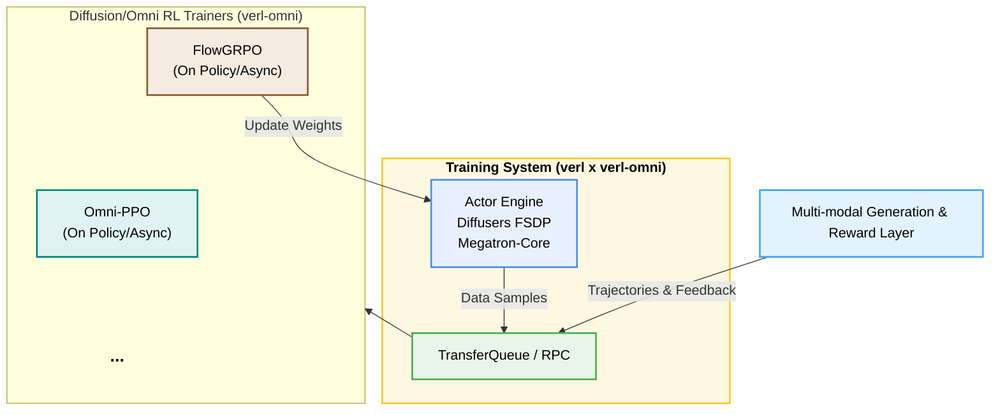
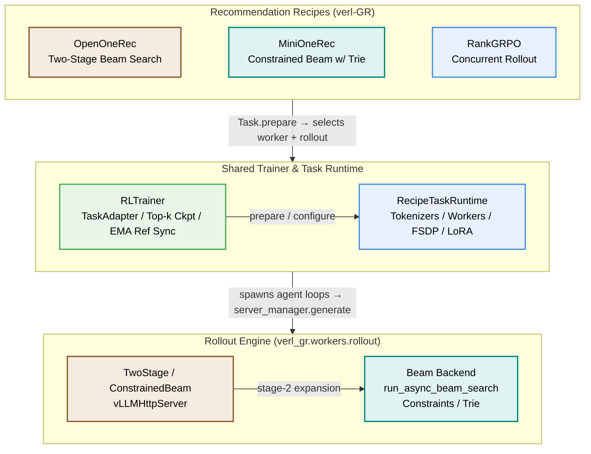

# key feature mermaids
## verl-omni

```mermaid
flowchart TD
    %% Define CSS classes for styling to match the image's color scheme
    classDef topLayer fill:#eaf5ea,stroke:#6ab06c,stroke-width:2px,color:#000,font-weight:bold
    classDef midLayer fill:#fff8e1,stroke:#ffca28,stroke-width:2px,color:#000,font-weight:bold
    classDef botLayer fill:#e3f2fd,stroke:#42a5f5,stroke-width:2px,color:#000,font-size:16px

    classDef brownBox fill:#f5ebe1,stroke:#8b5a2b,stroke-width:2px,color:#000
    classDef tealBox fill:#e0f2f1,stroke:#00897b,stroke-width:2px,color:#000
    classDef blueBox fill:#e8f0fe,stroke:#4a90e2,stroke-width:2px,color:#000
    classDef greenBox fill:#e8f5e9,stroke:#4caf50,stroke-width:2px,color:#000
    classDef plainText fill:none,stroke:none,color:#000,font-size:20px,font-weight:bold

    %% Top Layer Subgraph
    subgraph Trainers ["Diffusion/Omni RL Trainers (verl-omni)"]
        direction LR
        FlowGRPO["FlowGRPO<br>(On Policy/Async)"]:::brownBox
        OmniPPO["Omni-PPO<br>(On Policy/Async)"]:::tealBox
        Dots["..."]:::plainText
        
        FlowGRPO ~~~ OmniPPO ~~~ Dots
    end
    class Trainers topLayer

    %% Middle Layer Subgraph
    subgraph Training ["Training System (verl x verl-omni)"]
        direction LR
        Actor["Actor Engine<br>Diffusers FSDP<br>Megatron-Core"]:::blueBox
        Queue["TransferQueue / RPC"]:::greenBox

        Actor -- "Data Samples" --> Queue
    end
    class Training midLayer

    %% Bottom Layer (Single Node as shown in the primary image)
    MultiModal["Multi-modal Generation & Reward Layer"]:::botLayer

    %% Cross-Layer Arrow Connections
    FlowGRPO -- "Update Weights" --> Actor
    MultiModal -- "Trajectories & Feedback" --> Queue
    Queue --> Trainers
```

## verl-GR

```mermaid
flowchart TD
    classDef topLayer fill:#eaf5ea,stroke:#6ab06c,stroke-width:2px,color:#000,font-weight:bold
    classDef midLayer fill:#fff8e1,stroke:#ffca28,stroke-width:2px,color:#000,font-weight:bold
    classDef botLayer fill:#e3f2fd,stroke:#42a5f5,stroke-width:2px,color:#000,font-size:15px

    classDef brownBox fill:#f5ebe1,stroke:#8b5a2b,stroke-width:2px,color:#000
    classDef tealBox fill:#e0f2f1,stroke:#00897b,stroke-width:2px,color:#000
    classDef blueBox fill:#e8f0fe,stroke:#4a90e2,stroke-width:2px,color:#000
    classDef greenBox fill:#e8f5e9,stroke:#4caf50,stroke-width:2px,color:#000

    subgraph Recipes ["Recommendation Recipes (verl-GR)"]
        direction LR
        OpenOneRec["OpenOneRec<br>Two-Stage Beam Search"]:::brownBox
        MiniOneRec["MiniOneRec<br>Constrained Beam w/ Trie"]:::tealBox
        RankGRPO["RankGRPO<br>Concurrent Rollout"]:::blueBox

        OpenOneRec ~~~ MiniOneRec ~~~ RankGRPO
    end
    class Recipes topLayer

    subgraph Runtime ["Shared Trainer & Task Runtime"]
        direction LR
        RLTrainer["RLTrainer<br>TaskAdapter / Top-k Ckpt / EMA Ref Sync"]:::greenBox
        TaskRuntime["RecipeTaskRuntime<br>Tokenizers / Workers / FSDP / LoRA"]:::blueBox

        RLTrainer -- "prepare / configure" --> TaskRuntime
    end
    class Runtime midLayer

    subgraph Rollout ["Rollout Engine (verl_gr.workers.rollout)"]
        direction LR
        BeamServers["TwoStage / ConstrainedBeam<br>vLLMHttpServer"]:::brownBox
        SharedKernel["Beam Backend<br>run_async_beam_search<br>Constraints / Trie"]:::tealBox

        BeamServers -- "stage-2 expansion" --> SharedKernel
    end
    class Rollout botLayer

    Recipes -- "Task.prepare → selects worker + rollout" --> Runtime
    Runtime -- "spawns agent loops → server_manager.generate" --> Rollout
```