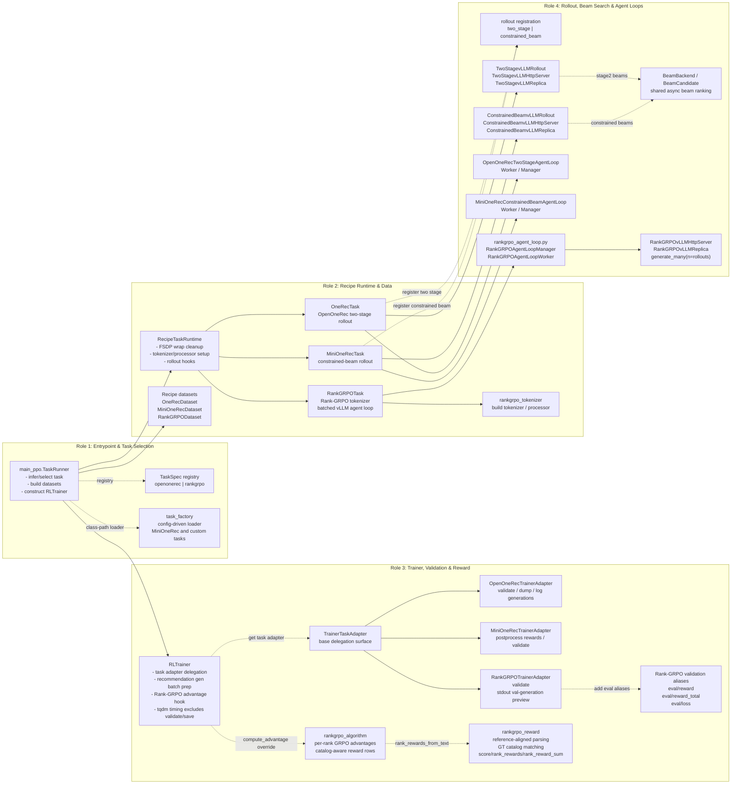

# `verl_gr` Design Diagram

This diagram shows how the three recipe workloads plug into the shared `verl_gr`
runtime after the recipe refactor. The main path is:

1. `verl_gr.trainers.main_ppo` selects a task runtime and builds datasets.
2. `RecipeTaskRuntime` or a recipe task prepares tokenizer, processor, worker class, and rollout registration.
3. `RLTrainer` delegates recipe-specific generation and validation through `TrainerTaskAdapter`.
4. Custom rollout workloads register recipe-specific async agent loops and vLLM server adapters.

## Recipe Integration Notes

- OpenOneRec uses `OneRecTask` to expand rollout counts by beam width, register the
  `two_stage` async rollout path, select `OneRecActorRolloutRefWorker`, and wire
  `OpenOneRecAgentLoopManager`. Its dataset, reward, and task runtime still live
  in `verl_gr/recipes/openonerec/onerec_recipe.py`; validation and checkpoint
  pruning live in `verl_gr/recipes/openonerec/onerec_trainer.py`.
- MiniOneRec uses `MiniOneRecTask` to register `constrained_beam`, select
  `MiniOneRecActorRolloutRefWorker`, and wire `MiniOneRecConstrainedBeamAgentLoopManager`.
  Dataset, reward, format helpers, worker shim, agent loop, and trainer adapter
  are separate recipe modules under `verl_gr/recipes/minionerec`.
- Rank-GRPO now keeps the logical rollout type as upstream `vllm`, but installs
  `rankgrpo_agent_loop.RankGRPOAgentLoopManager` through
  `actor_rollout_ref.rollout.agent.agent_loop_manager_class`. This manager uses a
  recipe-local `RankGRPOAgentLoopWorker`, `RankGRPOAsyncLLMServerManager`,
  `RankGRPOvLLMHttpServer`, and `RankGRPOvLLMReplica` to collapse contiguous
  repeated prompt rollouts into a single vLLM request with `n=<rollouts>`.
  The output is expanded back into the normal `DataProto` shape, including
  optional rollout logprobs for bypassing old-log-prob recomputation.
- Rank-GRPO recipe code is split across `rankgrpo_dataset.py`,
  `rankgrpo_task.py`, `rankgrpo_algorithm.py`, `rankgrpo_trainer.py`,
  `rankgrpo_reward.py`, `rankgrpo_agent_loop.py`, and
  `rankgrpo_tokenizer.py`, while `rankgrpo_recipe.py` remains a compatibility
  export module for existing config overrides. Reward computation is
  reference-aligned through `gt_catalog.pkl`; both validation and advantage
  recomputation use the same catalog-aware per-rank reward path. Validation also
  emits Rank-GRPO-style aliases: `eval/reward`, `eval/reward_total`, and
  `eval/loss`.

## Shared Runtime Flow

- `main_ppo.TaskRunner` resolves a task runtime, calls `prepare(config)`, creates
  train and validation datasets through upstream `create_rl_dataset`, then builds
  `RLTrainer`. Its current in-file registry directly maps `openonerec` and
  `rankgrpo`; `task_factory.py` remains the class-path loader for config-driven
  recipe task construction such as MiniOneRec.
- `RecipeTaskRuntime` centralizes common FSDP wrap-policy cleanup, HuggingFace
  tokenizer/processor creation, worker class selection, and rollout configuration
  hooks. OpenOneRec and MiniOneRec override the rollout hooks; Rank-GRPO overrides
  `prepare` to keep its tokenizer behavior unchanged.
- `RLTrainer` owns shared recommendation generation batch preparation. It delegates
  recipe validation and generation logging through task adapters, and calls
  `rankgrpo_algorithm.compute_rank_grpo_advantage` only when
  `algorithm.rank_grpo.enable` is true. Its local wrapper also adjusts the tqdm
  progress clock around validation and checkpoint saving so evaluation latency
  does not inflate the displayed training-step rate.
- `verl_gr.workers.rollout` contains the reusable beam-search infrastructure:
  registration helpers, two async vLLM server subclasses, rollout adapter classes,
  and the shared async beam backend used by both beam-search recipes. Rank-GRPO's
  fast path intentionally lives in `verl_gr/recipes/rankgrpo/rankgrpo_agent_loop.py`
  because it depends on Rank-GRPO's text-only, contiguous repeated-prompt batch
  layout rather than a reusable beam-search rollout primitive.

## Diagram Legend

- Each column is a role in the runtime path, from launch-time task selection to
  rollout execution.
- Solid arrows show the main construction or direct runtime handoff between
  role blocks.
- Dotted arrows show registry lookup, configuration-driven selection,
  delegation, registration, or dependency edges rather than direct ownership.
- Boxes group related classes/modules rather than listing every class method.
