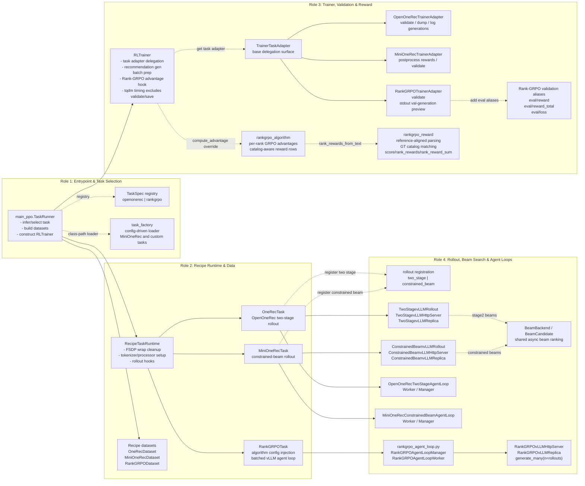

# `verl_gr` Design Diagram

## Framework-Side Features (Recipe-Agnostic)

The `trainers/` and `workers/` directories contain reusable infrastructure that any
recipe can opt into via config flags or method overrides — recipe code in
`recipes/<name>/` only does recipe-specific wiring.

### `trainers/` — Pluggable Training Infrastructure

- **Task registry + selection** ([main_ppo.py](../../verl_gr/trainers/main_ppo.py)) —
  `TASK_REGISTRY` maps task names to task factory functions. `_select_task()` resolves
  the task at startup with backward-compat heuristics. Adding a recipe requires only
  one registry entry — the runner never changes.
- **Task adapter delegation** ([task_adapter.py](../../verl_gr/trainers/task_adapter.py)) —
  `TrainerTaskAdapter` base class with overridable hooks (`prepare_gen_batch`,
  `validate`, `dump_generations`, `maybe_log_val_generations`, `postprocess_rewards`).
  Recipes subclass this to inject their own validation, logging, and reward processing.
  The trainer calls `self._get_task_adapter()` without importing recipe code.
- **Recommendation gen batch prep** ([rl_trainer.py](../../verl_gr/trainers/rl_trainer.py)) —
  `_prepare_recommendation_gen_batch()` strips prompt tensors before generation, wires
  beam-search config (`two_stage` / `constrained_beam`), resolves beam width, decode
  params, and constraints from both canonical and legacy config keys.
- **Top-k checkpoint pruning** — ranks checkpoints by a configurable validation
  metric, keeps the N best, and deletes the rest. Metric selection is config-driven
  with a recipe-aware fallback chain.
- **Latency-adjusted tqdm** — pauses the training progress bar during validation and
  checkpoint saving so eval latency doesn't inflate the displayed step rate.
- **LR metric synthesis** — infers actor LR from optimizer config + scheduler math
  (warmup, cosine decay) even when the worker omits `actor/lr`.
- **Parameter drift check** — at training milestones (steps 10, 50, 150, 300),
  queries workers for L2 drift from the SFT checkpoint.

### `workers/` — Reusable Rollout & Training Primitives

- **Rollout class registration** ([registration.py](../../verl_gr/workers/rollout/registration.py)) —
  dynamically injects custom rollout types and vLLM replica classes into verl's
  internal registries. Called by `OneRecTask.configure_rollout()` and
  `MiniOneRecTask.configure_rollout()` at startup.
- **Beam-search config resolution** ([beam_config.py](../../verl_gr/workers/rollout/beam_config.py)) —
  `BeamSearchConfig`, `TwoStageDecodeConfig`, `DecodePhaseConfig` dataclasses, with
  `resolve_beam_search_config()` / `resolve_two_stage_decode_config()` that handle
  both canonical and legacy config keys (`stage2_beam_size`, `stage1_max_tokens`, etc.).
  Shared by both two-stage and constrained-beam rollout paths.
- **Async beam search engine** ([beam_backend.py](../../verl_gr/workers/rollout/beam_backend.py)) —
  `BeamCandidate`, `beam_search_score()`, `run_async_beam_search()` — generic async
  beam search over token sequences with scoring, length penalty, and per-step
  constraint filtering. Used by both `TwoStagevLLMRollout` and
  `ConstrainedBeamvLLMRollout`.
- **Rollout packing primitives** ([primitives.py](../../verl_gr/workers/rollout/primitives.py)) —
  `prepare_prompt_token_inputs()` converts DataProto → vLLM format,
  `pack_rollout_batch()` converts generated responses back into verl-compatible
  DataProto, `expand_beam_candidates()` expands beam outputs across samples. Shared
  by all beam-based rollout paths.
- **Per-layer gradient hooks** ([grad_hooks.py](../../verl_gr/workers/grad_hooks.py)) —
  monkey-patches `FSDPEngine.train_batch` to log per-layer gradient L2 norms. Also
  fixes an FSDP2 in-place `div_` autograd disconnection bug. Opt-in — any worker
  calls `install_grad_hooks()` in `init_model()`.

## Architecture Diagram

This diagram shows how the three recipe workloads plug into the shared `verl_gr`
runtime. The main path is:

1. `verl_gr.trainers.main_ppo` selects a task runtime and builds datasets.
2. `RecipeTaskRuntime` or a recipe task prepares tokenizer, processor, worker class, and rollout registration.
3. `RLTrainer` delegates recipe-specific generation and validation through `TrainerTaskAdapter`.
4. Custom rollout workloads register recipe-specific async agent loops and vLLM server adapters.

## Recipe Integration Notes

- OpenOneRec uses `OneRecTask` to expand rollout counts by beam width, register the
  `two_stage` async rollout path, select `OneRecActorRolloutRefWorker`, and wire
  `OpenOneRecAgentLoopManager`. Its dataset, reward, and task runtime still live
  in `verl_gr/recipes/openonerec/onerec_recipe.py`; validation and checkpoint
  pruning live in `verl_gr/recipes/openonerec/onerec_trainer.py`.
- MiniOneRec uses `MiniOneRecTask` to register `constrained_beam`, select
  `MiniOneRecActorRolloutRefWorker`, and wire `MiniOneRecConstrainedBeamAgentLoopManager`.
  Dataset, reward, format helpers, worker shim, agent loop, and trainer adapter
  are separate recipe modules under `verl_gr/recipes/minionerec`.
- Rank-GRPO now keeps the logical rollout type as upstream `vllm`, but installs
  `rankgrpo_agent_loop.RankGRPOAgentLoopManager` through
  `actor_rollout_ref.rollout.agent.agent_loop_manager_class`. This manager uses a
  recipe-local `RankGRPOAgentLoopWorker`, `RankGRPOAsyncLLMServerManager`,
  `RankGRPOvLLMHttpServer`, and `RankGRPOvLLMReplica` to collapse contiguous
  repeated prompt rollouts into a single vLLM request with `n=<rollouts>`.
  The output is expanded back into the normal `DataProto` shape, including
  optional rollout logprobs for bypassing old-log-prob recomputation.
  - Rank-GRPO recipe code is split across `rankgrpo_dataset.py`,
  `rankgrpo_task.py`, `rankgrpo_algorithm.py`, `rankgrpo_trainer.py`,
  `rankgrpo_reward.py`, and `rankgrpo_agent_loop.py`, while
  `rankgrpo_recipe.py` remains a compatibility export module for existing
  config overrides. Reward computation is
  reference-aligned through `gt_catalog.pkl`; both validation and advantage
  recomputation use the same catalog-aware per-rank reward path. Validation also
  emits Rank-GRPO-style aliases: `eval/reward`, `eval/reward_total`, and
  `eval/loss`.

## Shared Runtime Flow

- `main_ppo.TaskRunner` resolves a task runtime, calls `prepare(config)`, creates
  train and validation datasets through upstream `create_rl_dataset`, then builds
  `RLTrainer`. Its current in-file registry directly maps `openonerec` and
  `rankgrpo`; `task_factory.py` remains the class-path loader for config-driven
  recipe task construction such as MiniOneRec.
- `RecipeTaskRuntime` centralizes common FSDP wrap-policy cleanup, HuggingFace
  tokenizer/processor creation, worker class selection, and rollout configuration
  hooks. OpenOneRec and MiniOneRec override the rollout hooks; Rank-GRPO overrides
  `prepare` to inject `rank_grpo` algorithm config into `actor_rollout_ref`,
  and overrides `get_actor_rollout_ref_worker` to select
  `RankGRPOActorRolloutRefWorker` (following the same worker-selection pattern
  as the other two recipes).
- `RLTrainer` owns shared recommendation generation batch preparation. It delegates
  recipe validation and generation logging through task adapters, and calls
  `rankgrpo_algorithm.compute_rank_grpo_advantage` only when
  `algorithm.rank_grpo.enable` is true. Its local wrapper also adjusts the tqdm
  progress clock around validation and checkpoint saving so evaluation latency
  does not inflate the displayed training-step rate.
- `verl_gr.workers.rollout` contains the reusable beam-search infrastructure:
  registration helpers, two async vLLM server subclasses, rollout adapter classes,
  and the shared async beam backend used by both beam-search recipes. Rank-GRPO's
  fast path intentionally lives in `verl_gr/recipes/rankgrpo/rankgrpo_agent_loop.py`
  because it depends on Rank-GRPO's text-only, contiguous repeated-prompt batch
  layout rather than a reusable beam-search rollout primitive.

## Diagram Legend

- Each column is a role in the runtime path, from launch-time task selection to
  rollout execution.
- Solid arrows show the main construction or direct runtime handoff between
  role blocks.
- Dotted arrows show registry lookup, configuration-driven selection,
  delegation, registration, or dependency edges rather than direct ownership.
- Boxes group related classes/modules rather than listing every class method.
