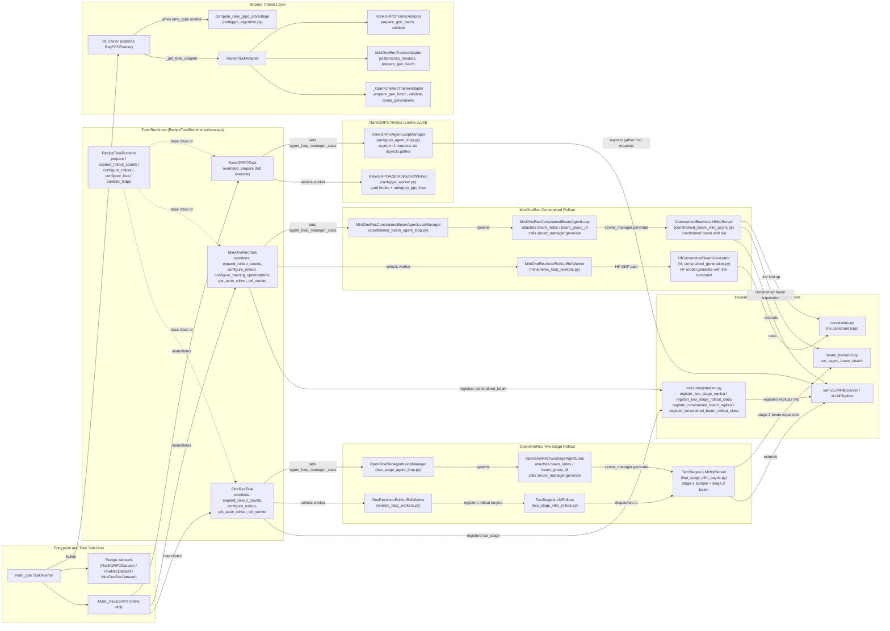

# `verl_gr` Design Diagram

This diagram shows how the three recipe workloads plug into the shared `verl_gr`
runtime after the recipe refactor. The main path is:

1. `verl_gr.trainers.main_ppo` selects a task via the hardcoded `TASK_REGISTRY`, calls `task.prepare(config)`, and builds datasets.
2. `RecipeTaskRuntime` subclasses (`OneRecTask`, `MiniOneRecTask`, `RankGRPOTask`) prepare tokenizer, processor, worker class, and rollout registration/configuration.
3. `RLTrainer` delegates recipe-specific generation, validation, reward postprocessing, and checkpoint management through `TrainerTaskAdapter`.
4. OpenOneRec and MiniOneRec register custom rollout replicas (`TwoStagevLLMReplica`, `ConstrainedBeamvLLMReplica`) and async agent loops under `verl_gr.workers.rollout`.
   **Beam expansion** runs in rollout-server classes (`TwoStagevLLMHttpServer`, `ConstrainedBeamvLLMHttpServer`); agent loops only attach metadata (`beam_index`, `beam_group_id`, etc.) and call `server_manager.generate(...)`.
   MiniOneRec additionally supports an HF DDP path via `HfConstrainedBeamGenerator` on the actor worker.
   RankGRPO uses vanilla vLLM with its own agent loop manager that fires concurrent `n=1` requests via `asyncio.gather`.

## Recipe Integration Notes

### OpenOneRec
- `OneRecTask` (in `recipes/openonerec/onerec_recipe.py`) extends `RecipeTaskRuntime`:
  - `expand_rollout_counts`: multiplies `rollout.n` by `beam_width` (stage-2 beam size)
  - `configure_rollout`: registers `two_stage` replica and rollout class via `registration.py`; sets `OpenOneRecAgentLoopManager` as the agent loop manager class
  - `get_actor_rollout_ref_worker`: returns `OneRecActorRolloutRefWorker` (from `onerec_fsdp_workers.py`)
- Dataset and reward functions also live in `onerec_recipe.py` (`OneRecDataset`, `compute_score`)
- `_OpenOneRecTrainerAdapter` (inline in `rl_trainer.py`) delegates to `onerec_trainer.py` for validation, generation dumping, and checkpoint pruning

### MiniOneRec
- `MiniOneRecTask` (in `recipes/minionerec/minionerec_recipe.py`) extends `RecipeTaskRuntime`:
  - `expand_rollout_counts`: multiplies `rollout.n` by `num_generations_per_prompt * beam_width`
  - `configure_rollout`: registers `constrained_beam` replica and rollout class; sets `MiniOneRecConstrainedBeamAgentLoopManager`; applies training optimizations
  - `configure_training_optimizations`: enables completion-only logprob for actor/ref, applies engine patches, switches optimizer to `paged_adamw_32bit`
  - `get_actor_rollout_ref_worker`: returns `MiniOneRecActorRolloutRefWorker` (from `minionerec_fsdp_workers.py`)
- `MiniOneRecConstrainedBeamAgentLoop` attaches `beam_index` / `beam_group_id` / `beam_search_params` then calls `server_manager.generate(...)` — beam expansion runs in `ConstrainedBeamvLLMHttpServer`
- The DDP/HF path (`HfConstrainedBeamGenerator` in `hf_constrained_generation.py`) lives on the actor worker and uses HF `model.generate()` with a prefix-trie constraint
- Trainer adapter (`MiniOneRecTrainerAdapter` in `minionerec_trainer.py`) handles reward postprocessing (`postprocess_rewards`) and model merge logic

### RankGRPO
- `RankGRPOTask` (in `recipes/rankgrpo/rankgrpo_task.py`) fully overrides `prepare()` to use `build_rankgrpo_tokenizer_and_processor` from `rankgrpo_tokenizer.py`
- Uses vanilla vLLM (no custom rollout registration) — rollout name stays as `vllm`
- `RankGRPOAgentLoopManager` (in `rankgrpo_agent_loop.py`) fires independent `n=1` vLLM requests concurrently via `asyncio.gather`, matching TRL's colocated generation behavior
- `RankGRPOActorRolloutRefWorker` (in `rankgrpo_worker.py`) installs gradient hooks and the `rankgrpo_ppo_loss` loss function
- Advantage computation in `rankgrpo_algorithm.py::compute_rank_grpo_advantage` activates when `algorithm.rank_grpo.enable` is true
- Recipe modules split across: `rankgrpo_dataset.py`, `rankgrpo_task.py`, `rankgrpo_algorithm.py`, `rankgrpo_trainer.py`, `rankgrpo_reward.py`, `rankgrpo_tokenizer.py`, `rankgrpo_loss.py`, `rankgrpo_worker.py`, `rankgrpo_agent_loop.py`
- `rankgrpo_recipe.py` is a compatibility re-export module

## Shared Runtime Flow

- `main_ppo.TaskRunner` resolves a task via the hardcoded `TASK_REGISTRY` dict (maps `"openonerec"`, `"minionerec"`, `"rankgrpo"` → `TaskSpec` factories), calls `task_impl.prepare(config)`, creates train/val datasets through upstream `create_rl_dataset`, then builds `RLTrainer`
- `task_factory.py` is a separate utility for lazy class-path loading — used by `RLTrainer._get_task_adapter()` to load `MiniOneRecTrainerAdapter`, and available for config-driven task construction
- `RecipeTaskRuntime` centralizes: FSDP2 wrap-policy cleanup (`sanitize_fsdp2_wrap_policy`), HuggingFace tokenizer/processor creation, worker class selection, FSDP wrap-policy alignment with HF model family, LoRA normalization, and rollout configuration hooks. Subclasses override specific hooks:
  - `OpenOneRecTask` / `MiniOneRecTask`: override `expand_rollout_counts`, `configure_rollout`, `get_actor_rollout_ref_worker`
  - `RankGRPOTask`: overrides `prepare` entirely (custom tokenizer, no rollout hooks)
- `RLTrainer` extends `RayPPOTrainer` with: recipe-aware gen batch preparation (`_prepare_recommendation_gen_batch`), task adapter delegation (`_get_task_adapter`), MiniOneRec REINFORCE loss old_log_prob bypass, top-k checkpoint management, EMAC ref sync, and configurable logging frequency
- `TrainerTaskAdapter` base class defines the override points: `prepare_gen_batch`, `validate`, `dump_generations`, `maybe_log_val_generations`, `postprocess_rewards`, `evaluate_and_prune_checkpoint`
- `_OpenOneRecTrainerAdapter` is defined inline in `rl_trainer.py` (delegates to `onerec_trainer.py`); `RankGRPOTrainerAdapter` and `MiniOneRecTrainerAdapter` are in their respective recipe directories
- `verl_gr.workers.rollout` contains the reusable beam-search infrastructure:
  - `registration.py`: replica and rollout class registration for `two_stage` and `constrained_beam`
  - `beam_backend.py`: `run_async_beam_search` — shared token-by-token beam search kernel
  - `beam_config.py`: constants (`BEAM_WIDTH_KEY`, `BEAM_SEARCH_PARAMS_KEY`, etc.) and config builders
  - `constraints.py`: prefix-trie constraint logic used by both constrained beam and HF DDP paths
  - `two_stage_vllm_async.py`: `TwoStagevLLMHttpServer` / `TwoStagevLLMReplica` — stage-1 sampling + stage-2 beam expansion
  - `constrained_beam_vllm_async.py`: `ConstrainedBeamvLLMHttpServer` / `ConstrainedBeamvLLMReplica` — constrained beam with trie
  - `two_stage_vllm_rollout.py` / `constrained_beam_vllm_rollout.py`: rollout adapter classes

## Diagram Legend

- Solid arrows show the primary runtime path.
- Dotted arrows show optional or fallback paths, mainly MiniOneRec's async vLLM route.
- Box groups show ownership boundaries: task/runtime selection, shared trainer,
  recipe-specific rollout wiring, and reusable rollout-engine infrastructure.
